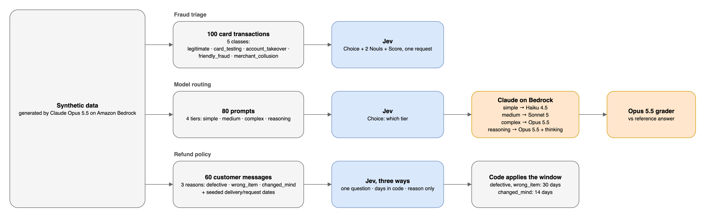

# jev-101-tests

Small experiments to learn how Jev, TypeSafe's decision model, behaves on three tasks.

## What Jev is

Jev is a decision model from TypeSafe AI. It does not write text. It fills in answers to questions you define, and every answer comes with probabilities.

The easiest way to see what that means is one task done two ways: first by asking an LLM for JSON, then by asking Jev.

### The same task with an LLM

This is the prompt sent to an LLM:

```
Transaction:
{
  "amount_band": "micro (<$5)",
  "velocity_1h": "many (10+)",
  "device": "headless browser, rotating user agents",
  "account_age": "under 30 days"
}

Answer three questions about this transaction.
1. label: Which fraud class best describes this card transaction?
   - legitimate: Normal purchase consistent with the cardholder's history.
   - card_testing: Many tiny charges probing whether stolen card details work.
   - account_takeover: Someone else controls the account.
2. cardholder_present: Was the genuine cardholder likely present for this transaction? true or false.
3. risk: How risky is this transaction overall? One of: very low, low, moderate, high, very high.

Reply with JSON only: {"label": ..., "cardholder_present": ..., "risk": ...}
```

And this is the reply, exactly as it came back:

````
```json
{
  "label": "card_testing",
  "cardholder_present": false,
  "risk": "very high"
}
```
````

The model writes the answer as text, one token at a time. Even though the prompt said "JSON only", the reply is wrapped in a Markdown fence, so your code has to strip it before parsing. Each field is a single value, with nothing to say how sure the model is.

### The same task with Jev

The same transaction, the same three questions and the same options, sent to Jev. The prompt is split into parts: the transaction becomes `state`, each numbered question becomes an entry in `questions`, and the list of options becomes that question's `criteria`. There is no "reply with JSON" line, because Jev can only answer in this shape.

This is the actual request the Python SDK sent through OpenRouter to `POST /v1/systemone`:

```json
{
  "model": "typesafe/jev-1.13",
  "state": {
    "amount_band": "micro (<$5)",
    "velocity_1h": "many (10+)",
    "device": "headless browser, rotating user agents",
    "account_age": "under 30 days"
  },
  "questions": {
    "label": {
      "type": "choice",
      "instructions": "Which fraud class best describes this card transaction?",
      "criteria": {
        "legitimate": "Normal purchase consistent with the cardholder's history.",
        "card_testing": "Many tiny charges probing whether stolen card details work.",
        "account_takeover": "Someone else controls the account."
      }
    },
    "cardholder_present": {
      "type": "noul",
      "instructions": "Was the genuine cardholder likely present for this transaction?"
    },
    "risk": {
      "type": "score",
      "instructions": "How risky is this transaction overall?",
      "criteria": ["very low", "low", "moderate", "high", "very high"]
    }
  }
}
```

What each argument means:

| Argument | What it is | In this example |
|---|---|---|
| `model` | Which Jev version answers. | `typesafe/jev-1.13` |
| `state` | The data to judge. A string, a JSON object or an array of text. Text only. | The transaction |
| `questions` | A map of questions. You pick the keys, and each answer comes back under the same key. The model never sees the keys. | `label`, `cardholder_present`, `risk` |
| `type` | The kind of answer: `choice`, `noul` or `score`. | One of each |
| `instructions` | The question, in plain language. | "Which fraud class best describes this card transaction?" |
| `criteria` | The allowed answers. For `choice`, a map of option name to description. For `score`, an ordered list of levels from low to high. For `noul`, optional descriptions of what yes and no mean. | Three fraud classes, five risk levels, none for the yes/no |

([Primitives](https://docs.typesafe.ai/primitives), [Models](https://docs.typesafe.ai/models))

And this is the response:

```json
{
  "model": "typesafe/jev-1.13-20260917",
  "answers": {
    "label": {
      "type": "choice",
      "choice": "card_testing",
      "probabilities": {"account_takeover": 0, "legitimate": 0, "card_testing": 1},
      "confidence": 1
    },
    "cardholder_present": {"type": "noul", "noul": 0.06},
    "risk": {
      "type": "score",
      "score": 3.89,
      "legend": {"0": "very low", "1": "low", "2": "moderate", "3": "high", "4": "very high"},
      "probabilities": {"0": 0, "1": 0, "2": 0, "3": 0.1, "4": 0.9},
      "confidence": 0.9
    }
  },
  "usage": {"input_tokens": 477, "output_tokens": 78, "cost": 2.0034e-05}
}
```

Reading it next to the LLM reply:

| Question | LLM said | Jev said |
|---|---|---|
| `label` | `"card_testing"` | `card_testing`, with all the probability on that option, confidence 1 |
| `cardholder_present` | `false` | `0.06`, meaning 6% likely yes |
| `risk` | `"very high"` | `3.89` on a 0 to 4 scale: 90% "very high", 10% "high", confidence 0.9 |

- `model` is the exact version that answered.
- `usage.cost` is added by OpenRouter. OpenRouter also adds `id` and `provider` fields, left out above.

### The three question types

| The field you'd ask an LLM for | Jev type | What you get back |
|---|---|---|
| An enum (`"legitimate" \| "card_testing" \| ...`) | `choice` | The picked option, a probability for every option, and a confidence |
| A boolean | `noul` | The probability that the answer is yes, from 0 to 1 |
| A rating on a scale you describe | `score` | A position on your scale, a probability for each level, and a confidence |
| A free-text string | not supported | Jev does not generate text |

### How it differs from asking an LLM for JSON

- **Each question is answered on its own.** All questions in a request are evaluated in parallel against the same data, and no answer sees another. If one question depends on another's answer, make a second request. ([Primitives](https://docs.typesafe.ai/primitives))
- **There is no reasoning step.** Each question should be a snap judgment. Split multi-factor questions into several small ones and combine the answers in code. Keep arithmetic, counting and date comparison in code. ([Primitives](https://docs.typesafe.ai/primitives), [Jev 1.13 jaggedness](https://docs.typesafe.ai/model-jaggedness/jev-1.13))
- **Your option descriptions are the prompt.** The option names and descriptions are both sent to the model, and it reads them literally. Write descriptions that clearly separate the options. ([Choice](https://docs.typesafe.ai/primitives/choice), [Jev 1.13 jaggedness](https://docs.typesafe.ai/model-jaggedness/jev-1.13))
- **Score and Noul values are not measurements.** A score of 3.5 means Jev is split between levels 3 and 4. A Noul of 0.8 means "80% likely yes", not "80% of the quality". ([Score](https://docs.typesafe.ai/primitives/score), [Noul](https://docs.typesafe.ai/primitives/noul))
- **Confidence is calculated, not written.** It comes from how spread out the probabilities are, so your code can set thresholds on it. For example, act when it's high and send the case to a person when it's low. ([Confidence](https://docs.typesafe.ai/confidence))
- **You pay only for input.** Jev costs $0.042 per million input tokens. Output tokens are free. ([Models](https://docs.typesafe.ai/models))

### Latency and cost we measured

Jev calls from the three experiments in this repo, measured from a laptop through OpenRouter. Latency is the full round trip, network included. Cost is what OpenRouter reported.

| Experiment | Jev calls | Questions per call | Latency p50 | Latency p95 | Jev cost per 1,000 calls |
|---|---|---|---|---|---|
| Fraud triage | 100 | 4 | 214 ms | 314 ms | $0.028 |
| Model routing | 80 | 1 | 275 ms | 392 ms | $0.018 |
| Refund policy | 180 (60 × 3 ways) | 1 | 232 to 241 ms | 323 to 410 ms | $0.016 to $0.017 |

The fraud calls cost more per call because each one carries four questions and a longer state. Latency barely changed with the extra questions.

Docs: [TypeSafe](https://docs.typesafe.ai/) and [Jev on OpenRouter](https://openrouter.ai/docs/guides/community/jev).

## How this repo works



- All test data is synthetic. Claude Opus 5.5 on Amazon Bedrock generates it with `--generate`.
- Jev is called through OpenRouter with the `typesafe-sdk` Python package.
- In routing, Claude models on Bedrock answer the routed prompts and Opus 5.5 grades each answer against a reference answer.
- Each experiment is one YAML config.

## Files

| Path | Purpose |
|---|---|
| `run.py` | CLI entry point. Loads a config, runs a use case or generates its dataset. |
| `clients.py` | Jev client (`ask_jev`), Bedrock client (`chat`), JSON parsing and cost helpers. |
| `usecases.py` | Dataset generation and per-row logic for fraud, routing and refund. |
| `report.py` | Turns `raw.jsonl` rows into `summary.md` metrics. |
| `configs/` | One YAML per use case. |
| `data/` | Generated datasets (not in the repo). Create with `--generate`. |
| `docs/` | Architecture diagram. |
| `tests/` | pytest tests for `report.py`. |

## Setup

Requires Python 3.12+ and [uv](https://docs.astral.sh/uv/).

```sh
uv sync
export OPENROUTER_API_KEY=...   # used for Jev only
```

Claude calls use AWS credentials from the default profile. The account needs Bedrock access to the Claude inference profiles named in the configs. The `us.` IDs are US cross-region inference profiles.

## Run

The datasets are not in the repo. Generate them first:

```sh
uv run python run.py configs/fraud.yaml --generate
uv run python run.py configs/routing.yaml --generate
uv run python run.py configs/refund.yaml --generate
```

Add `--force` to overwrite an existing dataset. Then run the experiments:

```sh
uv run python run.py configs/fraud.yaml
uv run python run.py configs/routing.yaml
uv run python run.py configs/refund.yaml
```

Each run writes `raw.jsonl` and `summary.md` to `results/<usecase>/<timestamp>/`, which is git-ignored.

Tests:

```sh
uv run pytest
```

## Config

Trimmed from `configs/routing.yaml`:

```yaml
tier_models:
  simple: {model: us.anthropic.claude-haiku-4-5-20251001-v1:0, extra: null}
  medium: {model: us.anthropic.claude-sonnet-5, extra: null}
  complex: {model: us.anthropic.claude-opus-5-5, extra: null}
  reasoning: {model: us.anthropic.claude-opus-5-5, extra: {thinking: {type: adaptive}, output_config: {effort: high}}}
questions:
  - id: tier
    type: choice
    instructions: Which model tier is the cheapest one that can answer this prompt well?
    criteria:
      simple: Lookup, rewording or short factual answers; no real reasoning.
      medium: Everyday writing, summarising or code with a few clear steps.
      complex: Long or specialised work needing expert knowledge and careful structure.
      reasoning: Multi-step maths, logic or planning where errors compound.
```

- `questions`: the Jev questions sent with each row. The first one is the primary answer that gets scored.
- `confidence_threshold`: the split point for the accuracy-by-confidence table in the summary.
- `max_rows`: how many dataset rows to run.
- `workers`: number of rows processed in parallel.
- `prices`: per-million-token list prices used to estimate Claude cost, since Bedrock returns tokens, not dollars.

## The experiments

### Fraud triage

Data: 100 card transactions, 20 per class. The classes are legitimate, card testing, account takeover, friendly fraud and merchant collusion. Opus 5.5 writes each class in one batch and is asked to include ambiguous cases. Every field is words or a named band, never a bare number.

Jev: one request per transaction with a Choice (fraud class), two Nouls (cardholder present, merchant suspicious) and a Score (risk).

Measured: precision, recall and F1 per class, accuracy above and below the confidence threshold, latency and cost.

### Routing

Data: 80 prompts, 20 per tier. The tiers are simple, medium, complex and reasoning. Opus 5.5 writes each prompt with a reference answer.

Jev: a Choice for the cheapest tier that can answer the prompt well. Simple goes to Haiku 4.5, medium to Sonnet 5, complex to Opus 5.5, and reasoning to Opus 5.5 with adaptive thinking. Every prompt is also sent to Opus 5.5 directly. Opus 5.5 grades each answer against the reference.

Measured: Jev tier accuracy and a confusion matrix. Graded correct rate and cost for three strategies: Jev routes every prompt, always Opus, and Jev routes with an Opus fallback when confidence is below a threshold.

### Refund policy

Data: 60 customer messages, 20 per reason. The reasons are defective, wrong item and changed mind. Opus 5.5 writes the messages without any dates. Code adds seeded delivery and request dates, and about half the requests land within 2 days of a 14- or 30-day mark.

Policy: 30 days for a defective or wrong item, 14 days for a changed mind.

Jev is asked in three ways:

1. One question. Jev reads the policy and both dates, and decides eligibility.
2. Days in code. Code counts the days since delivery, and Jev compares that number to the policy.
3. Reason only. Jev reads the reason, and code applies the window.

Measured: decision accuracy for each approach, overall and within 2 days of the limit, plus Jev's reason accuracy in the third approach.

## Things learned while building it

- The SDK base URL must be `https://openrouter.ai/api`. The SDK appends `/v1/systemone` itself.
- `typesafe/jev-1.13` works on OpenRouter, though it is not in the public model list.
- The SDK's `Usage` model drops OpenRouter's `cost` field, so `clients.py` reads it from the raw response.
- Noul answers are floats (P(yes)). Threshold them in code.
- Give every Choice option a one-line description.
- Opus 5.5 on Bedrock rejects `thinking.type=enabled`. Use `{"thinking": {"type": "adaptive"}, "output_config": {"effort": "high"}}`.
- A 4096 `maxTokens` cap truncated 20-record generation batches, so `chat` uses 16000.
